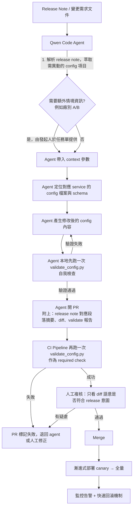

# Config 修改 Agent Workflow 設計文件

## 1. 背景與目標

### 痛點
| # | 痛點 | 影響 |
|---|---|---|
| 1 | 維運人員手動改 config 容易 typo | 錯誤程度不一，輕則服務行為異常、重則服務掛掉 |
| 2 | 閱讀 release note 耗時，且容易與開發人員認知落差 | 改錯欄位、改錯值、漏改欄位 |

### 目標
1. 用 Qwen Code Agent 讀 release 文件，自動產生對應的 config 修改 PR
2. 針對 service 自訂的 YAML/JSON（含 flat properties 格式），用**規則式驗證腳本**做最終把關，大幅降低 typo
3. 這套「文件 → agent 產生變更 → 自動驗證 → 人工複核 → 合併部署」的模式驗證成熟後，延伸到建廠 / APM 這類**時程不定的插單急件**，降低臨時任務對排程的衝擊（因為 agent 產生初稿的時間成本趨近於 0，人力只需要做複核）

### 設計原則
- **Agent 負責「產生變更」，不負責「決定變更是否正確」**：正確性由獨立、規則明確、可重複執行的驗證腳本把關，這樣即使 agent 本身出錯或幻覺，也不會直接流到線上
- **格式類問題 100% 交給機器判斷，人只判斷語意/意圖**：人工複核只看「這個改動合不合理」，不再逐字看格式，複核效率才會真的提升
- **規則（schema）與資料（config）分離治理**：規則由開發/資深維運維護並走嚴格審查，agent 與一般維運只碰資料本身

---

## 2. 整體流程



### 各階段角色與責任

| 階段 | 負責人/系統 | 產出 |
|---|---|---|
| 提供 release note / context | 開發人員 or 發起任務的維運 | 文件連結、廠別等情境參數 |
| 解析文件、生成 config 變更 | Qwen Code Agent | 修改後的 config + PR |
| 格式/typo 驗證 | validate_config.py（agent 本地 + CI 各跑一次）| 通過/失敗 + 具體錯誤清單 |
| 語意複核 | 維運人員（人工） | Approve / Request changes |
| 部署與監控 | CI/CD + 監控系統 | 上線結果 |

---

## 3. 為什麼要「agent 本地先跑一次驗證」再開 PR

這是刻意的設計，不是多餘的步驟：

- **降低人工複核被雜訊淹沒的機率**：如果連格式都沒過就開 PR，複核者會被一堆低階錯誤洗版，反而看不出真正的語意問題
- **給 agent 一個自我修正的迴圈**：agent 拿到驗證錯誤訊息後，可以直接根據錯誤訊息（見文件 2《typo 偵測規格》）修正後重跑，不需要人介入就能收斂
- **CI 端仍然要重跑一次**：因為 agent 本地執行環境可能與 CI 不同（例如 schema 版本、環境變數），CI 驗證是最後一道防線，不能省略

---

## 4. Schema／規則治理模式

### 4.1 一個 service 一份 schema
```
validator/
  schemas/
    service-fab-a.schema.yaml
    service-fab-b.schema.yaml
    service-fab-c.schema.yaml
  examples/
    ...
```
每個 schema 檔案描述：
- 這個 service 的 config 有哪些合法 key
- 每個 key 的型別、合法值（enum）、格式規則
- **每個 key 的用途描述（description）**——這是本次規格明確要求的：新增 key 時，開發必須同時補上 key 名稱、值的種類、以及描述，才能通過 schema 審查（見 4.2）
- 是否有「情境相依規則」（例如廠別 A/B 對應不同 URL pattern）

### 4.2 新增/修改 schema 的流程（給開發人員）
1. 開發在 release 中新增了一個 config key → 同一個 PR 裡，除了程式碼，也要更新對應的 `schemas/{service}.schema.yaml`
2. schema PR 會跑 **`validate_config.py --lint-schema`**，強制檢查：
   - 每個 key 都要有 `description`
   - 有 `enum` 的欄位，`enum` 不可為空
   - 有情境相依規則的欄位（如 factory），對應的 `context_params` 必須存在
3. 這類 PR 走比一般 config 變更**更嚴格**的審查（例如需要架構負責人 approve），因為它等於在擴充「合法值的定義權」
4. schema 更新後，QA/維運可以直接讀 schema 裡的 `description`，不用回頭問開發這個欄位是幹嘛的——這是解決「閱讀 release note 耗時、與開發認知落差」這個痛點的關鍵設計：**description 變成 schema 的一部分，長期累積下來就是一份持續更新、貼近實際規則的「活文件」**，比 release note 更可靠

### 4.3 多 service 對應
執行時用 `--service` 指定，程式會自動載入 `schemas/{service}.schema.yaml`：
```bash
python3 validate_config.py --schemas-dir schemas/ --service service-a --config configs/service-a/prod.yaml
```

未來 service 數量變多，可以用一份 manifest 描述「哪個 config 路徑對應哪個 schema」，一次批次驗證所有 service（見 `manifest.example.yaml`），適合放在 CI 裡做全倉庫掃描。

---

## 5. Future Work：延伸到建廠 / APM 等插單急件

現階段先把「config 修改」這個範圍窄、規則明確的場景做穩，原因是：
- config 的合法值與格式可以用 schema 完整定義，驗證可以做到接近 100% 自動化，適合先建立對「agent 產出 + 自動驗證」這個模式的信任
- 建廠、APM 這類任務通常**沒有固定 schema、步驟因案而異**，直接上 agent 風險較高

延伸路徑建議：
1. **先把可複用的部分抽象出來**：release note 解析能力、PR 產生流程、驗證-複核-部署的 pipeline 骨架，這些跟「改的是不是 config」無關，可以直接沿用
2. **針對建廠/APM 逐步建立「半結構化」的任務模板**（類似 config 的 schema，但可能是檢查清單 checklist 而非嚴格 schema），讓 agent 產出的內容有一個可對照的標準,即使不到「自動判斷對錯」的程度,至少能自動判斷「有沒有漏填」
3. **急件的價值在於降低 agent 產出初稿的前置時間**，人力可以專注在複核與決策，而不是從零開始生資料——即使驗證自動化程度不如 config 高，也已經能顯著降低插單對排程的衝擊