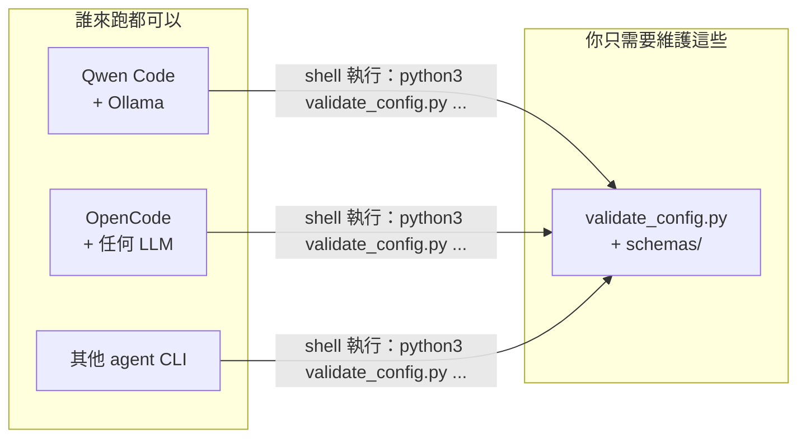
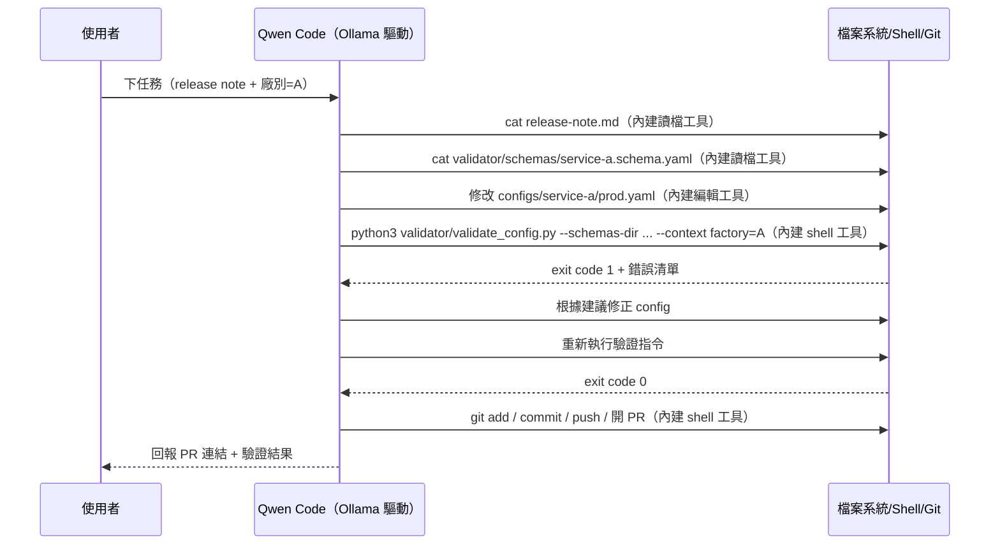

# 用 Qwen Code / OpenCode 實現 Config 修改 Workflow（不需要架 MCP Server）

給不熟悉這類 agent CLI 的人看的完整實作指南。讀完這份文件，你會知道：
1. 為什麼這個場景**不需要**額外架一個 MCP Server，直接讓 agent 用內建的 shell 工具跑驗證腳本就夠了
2. 怎麼讓 Qwen Code 接上 Ollama（或任何 LLM API）
3. 怎麼寫任務指示，讓 agent 知道「什麼時候該跑哪個指令、怎麼看懂結果」
4. 怎麼用完全一樣的做法在 OpenCode 重現，證明這套做法不綁架構
5. 附錄：如果之後真的有需要，MCP 什麼時候才值得上

---

## 1. 核心判斷：這裡不需要 MCP Server

### 1.1 先分清楚兩件事

- **MCP**：一個協定，用來把「一組工具」包裝成一個獨立行程，讓 agent 用標準化方式呼叫
- **你實際需要的東西**：agent 能執行一支 Python 腳本（`validate_config.py`）、讀懂它印出來的結果

第二件事，Qwen Code、OpenCode 這類 agent CLI **內建就有**——它們都有「執行 shell 指令」跟「讀寫檔案」的能力，這是它們作為「coding agent」的基本配備，就跟它們平常會自己跑 `pytest`、`eslint`、`terraform plan` 一樣。`validate_config.py` 對它們來說跟這些工具沒有本質上的差異，都是「跑一個指令、看退出碼、讀輸出」。

### 1.2 那前面設計的 MCP Server 是不是白做了？

不算白做，但這裡確實用不上。MCP 真正解決的問題是：**當 agent 沒有能力直接做某件事時**（例如要串接一個沒有 CLI 介面的內部系統 API、或者你想限制 agent 只能做這一件事而不是給它整個 shell 的權限），才需要包一層 MCP 工具當作「新的能力」或「更窄的權限邊界」交給它。

而 `validate_config.py` 本身就是一支現成的 CLI 工具，agent 用 shell 就能直接跑，中間多一層 MCP 協定，只是多了：
- 一個要在 agent 啟動時被拉起的子行程
- 一層協定轉換（JSON-RPC over stdio）
- SDK 版本相容性問題（我們在測試時就實際踩到 `FastMCP` 改名的坑）

這些成本沒有換到對應的好處，所以拿掉。**附錄章節會列出「什麼情況下 MCP 才值得上」，把之前寫好的 MCP Server 留著，但不是這次的主線做法。**

### 1.3 拿掉 MCP 之後，整體架構變得更單純



跟前一版比，少了「MCP Server」這一層，agent 換誰來當，一樣是靠「它本來就有的 shell 能力」去跑同一支腳本——這其實比 MCP 更普及，因為不是所有 agent CLI 的 MCP client 實作都一樣成熟，但「執行 shell 指令」幾乎是這類工具的必備能力，反而更能保證「不綁架構」。

---

## 2. 動手做（一）：Ollama 準備

跟是否用 MCP 無關，這一步不變：

```bash
curl -fsSL https://ollama.com/install.sh | sh
ollama pull qwen2.5-coder:7b
ollama serve
```

Ollama 預設在 `http://localhost:11434` 提供一個 OpenAI-compatible 的介面，這是後面「LLM 可抽換」的關鍵。

---

## 3. 動手做（二）：Qwen Code

### 3.1 安裝與接上 Ollama

```bash
npm install -g @qwen-code/qwen-code

export OPENAI_API_KEY="ollama"
export OPENAI_BASE_URL="http://localhost:11434/v1"
export OPENAI_MODEL="qwen2.5-coder:7b"
```

放進專案的 `.env` 或 `~/.qwen/.env`，每次啟動 `qwen` 自動套用。之後要換成雲端 API，只要改這三個值。

> **不需要 `.qwen/settings.json` 的 `mcpServers` 設定**——因為這次不用 MCP，agent 靠它內建的 shell 工具直接跑腳本就好。

### 3.2 任務指示（`QWEN.md`）

這是整套設計裡最重要的一份文件，因為拿掉 MCP 之後，「agent 該怎麼跑驗證腳本」這件事不再由工具的函式簽名（docstring）告訴模型，而是要靠這份指示文件講清楚。內容直接告訴 agent **實際的指令長什麼樣子**：

```markdown
# Config 修改任務規則

## 專案結構
- 各 service 的規則定義在 `validator/schemas/{service}.schema.yaml`
- 驗證腳本是 `validator/validate_config.py`

## 修改 config 前
1. 先用 `cat validator/schemas/{service}.schema.yaml` 讀出這個 service 的規則，
   了解有哪些合法欄位、enum、格式，不要憑經驗猜測
2. 如果 schema 裡有 `context_params`（例如 factory 廠別），這個值必須由任務
   發起人在任務描述中明確提供；如果沒有提供，停下來詢問，不可以自己猜一個值套用

## 修改完 config 之後，必須執行驗證
用以下指令驗證（把 {service}、{config_path}、{context} 換成實際值）：

    python3 validator/validate_config.py \
      --schemas-dir validator/schemas --service {service} \
      --config {config_path} --context factory={factory}

- 退出碼 0 代表全部通過
- 退出碼非 0 代表有問題，畫面上每一項都會列出「類型」「目前值」「問題說明」
  「建議修正」，請照著建議修正後重新執行這條指令
- 如果想要結構化的 JSON 結果方便自己解析，可以加上 `--json` 參數
- 最多重試 3 次；3 次後仍未通過，停下來回報具體卡住的錯誤內容，不要為了
  通過驗證硬塞一個格式合法但語意可疑的值

## 開 PR 前
把最後一次驗證通過的完整輸出，貼進 PR 說明的「驗證結果」區塊
```

Qwen Code 會自動把專案根目錄的 `QWEN.md` 當作系統層級指示讀進去。

### 3.3 實際跑一次

```bash
qwen "請根據 release-note.md 的說明，修改 configs/service-a/prod.yaml，
廠別是 A，改完後幫我驗證並開一個 PR"
```

背後發生的事：



跟前一版比較：**整個流程少了一個角色（MCP Server），agent 從頭到尾只跟「檔案系統/shell」互動**，這也是它平常做任何 coding 任務的標準模式，不需要額外學一套新的協定。

---

## 4. 動手做（三）：OpenCode（證明不綁架構）

### 4.1 安裝與接上 Ollama

```bash
curl -fsSL https://opencode.ai/install | bash
```

`opencode.json`：
```json
{
  "$schema": "https://opencode.ai/config.json",
  "model": "ollama/qwen2.5-coder:7b",
  "provider": {
    "ollama": {
      "npm": "@ai-sdk/openai-compatible",
      "name": "Ollama (local)",
      "options": { "baseURL": "http://localhost:11434/v1" },
      "models": { "qwen2.5-coder:7b": { "name": "qwen2.5-coder:7b" } }
    }
  }
}
```

### 4.2 任務指示（`AGENTS.md`）

跟第 3.2 節的 `QWEN.md` **內容完全一樣**，只是檔名換成 OpenCode 的慣例 `AGENTS.md`。不需要為了換 agent CLI 重寫任何指令邏輯，因為指示的內容本來就只是「該跑哪支腳本、怎麼讀結果」，跟用哪個 agent CLI 無關。

### 4.3 實際跑一次

```bash
opencode run "請根據 release-note.md 的說明，修改 configs/service-a/prod.yaml，
廠別是 A，改完後幫我驗證並開一個 PR"
```

流程跟第 3.3 節的時序圖完全一樣，只是「跑指令的人」換成 OpenCode。**這就是「不綁架構」在拿掉 MCP 之後依然成立的原因**：只要換掉的 agent CLI 也有 shell 執行能力（幾乎所有 coding agent 都有），同一份 `validate_config.py` + 同一份任務指示文件就能直接搬過去用，不需要另外寫一層工具介面去適配它。

---

## 5. 這套設計為什麼還是做到「不綁架構」——兩層拆分

拿掉 MCP 之後，原本的三層變成兩層：

| 層次 | 這一層負責什麼 | 換掉會不會動到其他層 |
|---|---|---|
| **LLM 後端**（Ollama / 雲端 API） | 決策：接下來該跑什麼指令、怎麼修正 config、怎麼組 PR 說明 | 換掉只需要改 agent CLI 的 provider/環境變數設定 |
| **Agent CLI**（Qwen Code / OpenCode / 其他） | 執行環境：讀寫檔案、跑 shell/git、管理跟 LLM 的對話迴圈 | 換掉只需要照新工具的語法重寫設定檔跟任務指示檔名，`validate_config.py` 跟 schema 完全不用動 |

`validate_config.py` + `schemas/` 這份「業務知識」本身不算獨立的一層架構，它單純是一份被兩邊都拿來當工具用的**資產**，這正是它能被輕鬆搬到任何 agent CLI 的原因——它從頭到尾就是一支普通的、任何環境都能執行的 Python CLI 工具，沒有跟任何框架耦合。

---

## 6. 常見疑問

**Q：agent 會不會亂跑 shell 指令，把不該碰的東西改壞？**
這是「給 agent shell 權限」本身固有的風險，跟要不要用 MCP 無關——就算包成 MCP 工具，如果 agent 同時仍保有一般 shell 權限，一樣可以繞過去做其他事。真的要收斂 agent 的能力邊界（例如「這個 agent 只能跑驗證腳本、不能碰其他指令」），比較實際的做法是用 agent CLI 本身的權限設定（大部分工具都有「哪些指令需要人工確認」「哪些目錄可寫」的設定），而不是靠 MCP 包一層——MCP 包出來的工具，如果 agent 同時還有 shell 權限，並不會真的把權限鎖死。

**Q：本地小模型會不會忘記跑驗證、直接編答案交差？**
這是實務上真的會發生的狀況，尤其是本地跑的小模型。緩解方式：
- 在任務指示裡把「必須執行驗證、貼出結果」寫得更前置、更強硬（見第 3.2 節範例）
- CI 端一定要再跑一次同一支 `validate_config.py` 當作 required check（這一步不管 agent 有沒有偷懶都會擋下），這才是真正的保險，agent 本地有沒有先跑只是效率問題，不是正確性的最後防線

**Q：以後如果真的需要更嚴格的權限控制，或是要接一個沒有 shell 能力的介面（例如純聊天機器人），MCP 還有機會用上嗎？**
有，見下方附錄。之前寫好的 MCP Server 沒有丟掉，只是移到 `optional-advanced-mcp/` 目錄，標記為「非必要、先備用」。

---

## 附錄：什麼時候 MCP 才真的值得上

不是說 MCP 沒用，而是「用不用 MCP」應該取決於具體情境，以下是幾種**值得**考慮上 MCP 的情況，供未來參考：

| 情境 | 為什麼 MCP 有幫助 |
|---|---|
| 要接的「能力」agent 本身沒有，例如查詢一個沒有 CLI 介面、只能用內部 API 呼叫的系統 | MCP Server 可以把這個 API 包成一個工具，這是 agent 原生做不到的事，MCP 在這裡是真的補上一塊新能力，不是重複包裝 |
| 想讓 agent 的能力**收斂**到只能做特定幾件事，而不是給它整個 shell（例如面對權限敏感的環境，不想讓 agent 有能力跑任意指令）| 搭配 agent CLI 本身「關閉/限制 shell 工具、只允許用某些 MCP 工具」的設定，可以做出更窄的能力邊界（單純包 MCP 工具、agent 同時仍有 shell 權限的話，效果有限，見上方常見疑問） |
| 要把同一套邏輯，同時提供給「有 shell 能力的 coding agent」跟「沒有 shell 能力的介面」共用（例如一個純聊天機器人、或是某個只支援工具呼叫協定不支援執行任意指令的產品）| 這種情境下對方沒有 shell 可用，MCP（或任何形式的工具協定）才是唯一的橋接方式 |
| 需要把工具**動態發現**的能力交給 agent（agent 不知道有哪些工具存在，需要在執行期查詢），而不是寫死在任務指示文件裡 | MCP 的 `tools/list` 天生就是做這件事的，一份靜態的 `QWEN.md`/`AGENTS.md` 做不到「執行期動態告知有什麼新工具上線」 |

如果以後遇到上述情境，`optional-advanced-mcp/server.py` 可以直接拿來用（已經用真實的 MCP client-server protocol 測試跑通過），不用重新從零寫起。